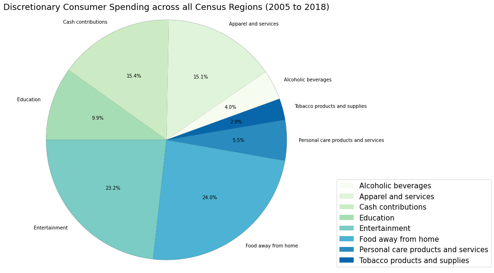
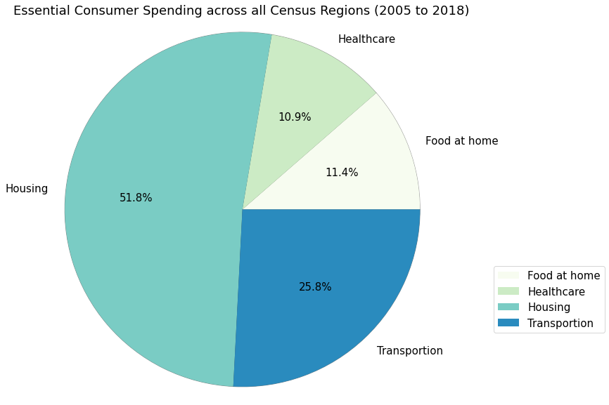
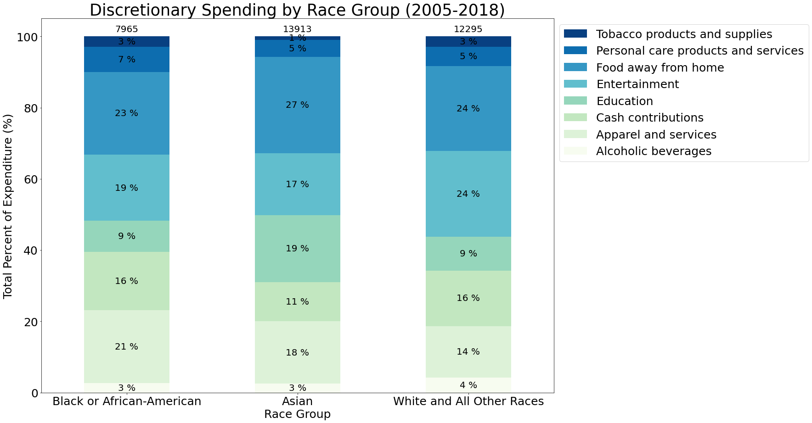

{
 "cells": [
  {
   "cell_type": "markdown",
   "metadata": {},
   "source": [
    "# Project Summary\n",
    "## Description\n",
    "Analysis of spending behavior of discretionary income in the US.\n",
    "Discretionary income is the income remaining to spend on nonessential items.\n",
    "\n",
    "All data is from the US Bureau of Labor Statistics (www.bls.gov)\n",
    "\n",
    "## Analysis Questions\n",
    "### How is the overall discretionary income in the US spent?\n",
    "The data suggests the following differences across all consumer units:\n",
    "1. Approximately half of discretionary income is spent on food away and entertainment. \n",
    "2. The next highest nonessential spending is in cash contributions.\n",
    "\n",
    "\n",
    "### How is the overall essential income in the US spent?\n",
    "The data suggests the following differences across all consumer units: \n",
    "1. Most essential expenditure is on housing expenses, which is more than half of the other 3 categories (health, food at home, and transportation). \n",
    "2. Transportation is the seconnd largest category of essential spending with food at home and healthcare expenses being about the same. \n",
    "\n",
    "\n",
    "### How does age group impact the spread of discretionary spending?\n",
    "The data suggests the following differences across age groups:\n",
    "1. Cash contributions expenditure consistently increase as age groups increase. This is a direct correlation.\n",
    "2. Education expenditure decreases beyond the age of 25 with the exception of age group 45 to 54 where this age group has a dramatic increase in education expenditure. The peak at 45 to 54 likely suggest the education costs associated with children in college.\n",
    "3. Total discretionary spending is the highest in the age group 45 to 54\n",
    "\n",
    "\n",
    "### How does geographic region in the US impact the spread of discretionary spending?\n",
    "The data suggests the following differences across regions:\n",
    "1. The highest percentage of discretionary spending are in the entertainment and food away from home categories. \n",
    "2. Total discretionary spending is the highest in the western and notherneast regions of the US.\n",
    "3. Discretionary expenditure categories are not significant different. \n",
    "\n",
    "\n",
    "### How does education level impact the spread of discretionary spending?\n",
    "The data suggests the following differences across regions:\n",
    "1. Tobacco expenditure decreases as education level increases\n",
    "2. Cash contributtion, education, and total discretionary expenditure increases with education level.\n",
    "\n",
    "\n",
    "### How does race impact the spread of discretionary spending?\n",
    "BLS breaks race into three categories - Black or African-American, Asian, and White and All Other. The data suggests the following differences across race groups:\n",
    "1. The Asian race group spends the highest percentage in education expenditure and the lowest percentage in cash contributions compared to the other race groups.\n",
    "2. White and other race groups spend the highest percentage in entertainment and the lowerst percentage in apparel expenditure compared to the other race groups.\n",
    "3. Black or African-American race groups spend the highest percentage in apparel when compared to the other race groups.\n",
    "\n",
    "\n",
    "### Based on previous economic recessions, how might consumer expenditure adjust in recovering from the coronavirus shut downs?\n",
    "The 2009 data following the 2008 recession suggests the following:\n",
    "1. Discretionary spending decreased in every category except education and tobacco. \n",
    "2. The greatest percent increase in spending was observed in tobacco products. \n",
    "3. The greatest percent decrease in spending was observed in entertainment and apparel. \n",
    "4. Considering the the indefinite pause on many entertainment events or services caused but the pandemic, a significant decrease in entertainment is likely to be observed again.\n",
    ""
   ]
