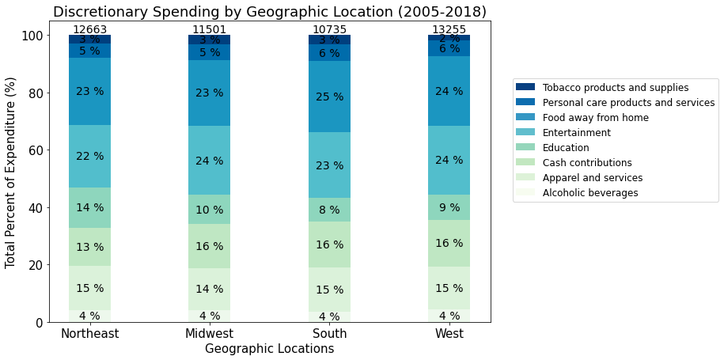
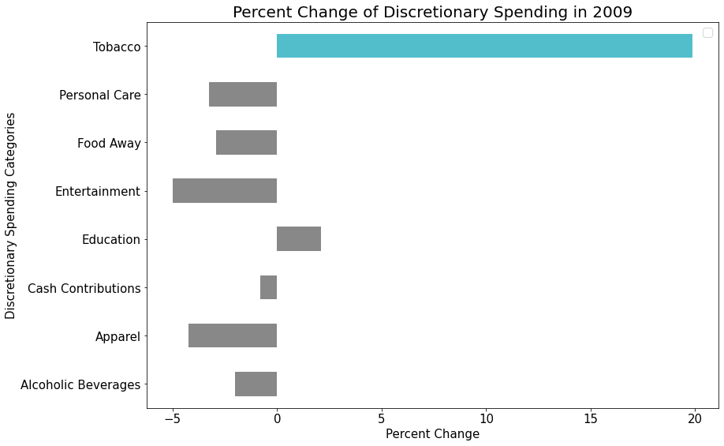

# US Spending Behaviors of Discretionary Income
## Project Description

Project 1 for Rutgers Data Science program. Analysis of consumer discretionary spending by different demographic factors.

In a time of financial struggles facing the US during the time of a pandemic, we were inspired to analyzed consumer spending of their extra money, that is their discretionary money, over the years. We're curious to uncover spending patterns from the past two decades to speculate on the consumer behavioral changes that might be occuring now. Specifically, we sought insights through the following questions:

1. What are the overall average spending of discretionary income?
2. Looking at trends from the 2008 economic recessions, how might consumers expenditure adjust in recovering from the coronavirus shut downs?
    - Compute the annual percent change in expenditure in 2009
3. What affect does demographics have on discretionary spending?
    - Age of reference person
    - Race
    - Gender
    - Highest education level
    - Region of residence
    - Income class
4. Are there any trends that should be further analyzed from the above analysis?

    # Project Summary
    
    All data is from the US Bureau of Labor Statistics (www.bls.gov)

    ### How is the overall discretionary income in the US spent
    The data suggests the following differences across all consumer units
    1. Approximately half of discretionary income is spent on food away and entertainment.
    2. The next highest nonessential spending is in cash contributions

    
    
    ### How is the overall essential income in the US spent
    The data suggests the following differences across all consumer units:
    1. Most essential expenditure is on housing expenses, which is more than half of the other 3 categories (health, food at home, and transportation).
    2. Transportation is the seconnd largest category of essential spending with food at home and healthcare expenses being about the same.

    
    
    ### How does age group impact the spread of discretionary spending
    The data suggests the following differences across age groups
    1. Cash contributions expenditure consistently increase as age groups increase. This is a direct correlation
    2. Education expenditure decreases beyond the age of 25 with the exception of age group 45 to 54 where this age group has a dramatic increase in education expenditure. The peak at 45 to 54 likely suggest the education costs associated with children in college
    3. Total discretionary spending is the highest in the age group 45 to 5

    
    
    ### How does geographic region in the US impact the spread of discretionary spending
    The data suggests the following differences across regions
    1. The highest percentage of discretionary spending are in the entertainment and food away from home categories.
    2. Total discretionary spending is the highest in the western and notherneast regions of the US
    3. Discretionary expenditure categories are not significant different.

    
    
    ### How does education level impact the spread of discretionary spending?
    The data suggests the following differences across regions:
    1. Tobacco expenditure decreases as education level increases
    2. Cash contributtion, education, and total discretionary expenditure increases with education level.

    
   
    ### How does race impact the spread of discretionary spending?
    BLS breaks race into three categories - Black or African-American, Asian, and White and All Other. The data suggests the following differences across race groups:
    1. The Asian race group spends the highest percentage in education expenditure and the lowest percentage in cash contributions compared to the other race groups.
    2. White and other race groups spend the highest percentage in entertainment and the lowerst percentage in apparel expenditure compared to the other race groups.
    3. Black or African-American race groups spend the highest percentage in apparel when compared to the other race groups.

    
    
    ### Based on previous economic recessions, how might consumer expenditure adjust in recovering from the coronavirus shut downs?
    The 2009 data following the 2008 recession suggests the following:
    1. Discretionary spending decreased in every category except education and tobacco.
    2. The greatest percent increase in spending was observed in tobacco products.
    3. The greatest percent decrease in spending was observed in entertainment and apparel.
    4. Considering the the indefinite pause on many entertainment events or services caused but the pandemic, a significant decrease in entertainment is likely to be observed again.
    
    
